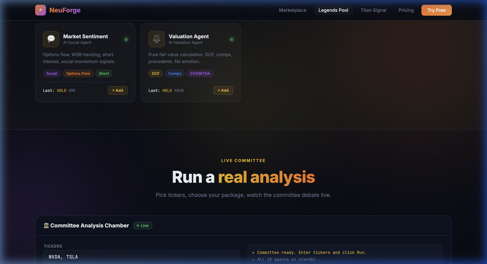

# 🏛️ NeuForge Legends

**18 AI investment agents modeled on the greatest investors of all time.**

Warren Buffett. Michael Burry. Charlie Munger. Cathie Wood. Bill Ackman. And 13 more — each analyzing stocks through their own philosophy, debating, and voting on every trade.

[](https://badge.fury.io/py/neuforge-legends)
[](https://www.python.org/downloads/)
[](LICENSE)
[](https://neuforge.app/discord)
[](https://neuforge.app/legends)



---

## What it does

```python
from neuforge import LegendsPool

pool = LegendsPool()  # uses GROQ_API_KEY from env

result = pool.analyze(["NVDA", "TSLA"], package="pro")  # 10 legend committee

print(result.consensus)    # "STRONG BUY"
print(result.confidence)   # 0.8
print(result.summary())    # Full committee debate
```

**Output:**

```
Committee Result for NVDA, TSLA
──────────────────────────────────────────────────
Consensus: STRONG BUY (confidence: 80%)
Votes: BUY=8 | HOLD=2 | SELL=0
──────────────────────────────────────────────────
[BUY ] Warren Buffett: NVDA has an extraordinary economic moat in AI compute...
[BUY ] Michael Burry: Despite hype, the fundamentals justify current valuation...
[BUY ] Cathie Wood: NVDA is the backbone of the AI revolution. 5-year target...
[HOLD] Charlie Munger: Quality is undeniable but price leaves thin margin of safety...
[BUY ] Bill Ackman: Activist opportunity is nil but the business is exceptional...
```

---

## The Committee

| Agent | Philosophy | Style |
|---|---|---|
| 🎩 Warren Buffett | Wonderful businesses at fair prices. Moat-first. | Value |
| 🦉 Charlie Munger | Mental models + margin of safety. Avoid stupidity. | Value |
| 🔍 Michael Burry | Contrarian. Buys what everyone hates. | Contrarian |
| 🚀 Cathie Wood | Disruptive innovation. 5-year horizon. | Growth |
| 📢 Bill Ackman | Activist. Bold concentrated positions. | Activist |
| 📚 Ben Graham | Father of value investing. Margin of safety only. | Deep Value |
| 📊 Aswath Damodaran | Every story needs a number. DCF-first. | Valuation |
| 🏪 Peter Lynch | Invest in what you know. GARP. Tenbaggers. | GARP |
| 🔬 Phil Fisher | Scuttlebutt research. Quality growth. | Quality |
| 🌍 Stanley Druckenmiller | Go for the jugular on high conviction. | Macro |
| 🎲 Mohnish Pabrai | Dhandho. Asymmetric returns only. | Dhandho |
| 🏏 Rakesh Jhunjhunwala | Emerging market compounders. | EM Growth |
| 📈 Technical Analyst | RSI, MACD, price action. | Technical |
| 🏦 Fundamentals Analyst | EPS, FCF, balance sheet. | Fundamentals |
| 🌱 Growth Analyst | TAM, NRR, Rule of 40. | SaaS Growth |
| 📰 News Sentiment | Real-time news impact. | Sentiment |
| 💬 Market Sentiment | Options flow, short interest. | Social |
| ⚖️ Valuation Agent | Pure DCF and comps. No emotion. | Pure Valuation |

---

## Packages

| Package | Agents | Best For |
|---|---|---|
| `starter` | 3 of your choice | Getting started |
| `pro` | 10 agents | Serious analysis |
| `allstars` | All 18 | Full committee |

---

## Quick Start

### 1. Get a free Groq API key

→ [console.groq.com](https://console.groq.com) — free tier, no credit card

### 2. Install

```bash
pip install neuforge-legends
```

### 3. Run

```bash
export GROQ_API_KEY=your_key_here
python examples/demo.py
```

### Custom committee

```python
from neuforge import LegendsPool

pool = LegendsPool()

# Build your own committee
result = pool.analyze(
    tickers=["AAPL", "GOOGL"],
    analysts=["warren_buffett", "michael_burry", "cathie_wood"]
)

# See each agent's vote
for vote in result.votes:
    print(f"[{vote.signal}] {vote.agent_name}: {vote.reasoning}")
```

---

## How it works

```
Your tickers
     ↓
Each legend agent gets the stock data
     ↓
Each agent reasons through their own philosophy
     ↓
Each agent votes: BUY / HOLD / SELL
     ↓
Committee aggregates → Consensus signal
     ↓
You copy the call (or use neuforge.app for auto-execution)
```

---

## Want the full platform?

NeuForge Legends runs locally for free. For **auto-execution, copy trading, real-time signals, and Titan Signal integration**, visit:

👉 **[neuforge.app/legends](https://neuforge.app/legends)**

- Starter: $49/mo — 3 legends
- Pro: $149/mo — 10 legends
- All-Stars: $299/mo — All 18 + Titan Signal

---

## Local dev

```bash
git clone https://github.com/neuforge/neuforge-legends
cd neuforge-legends
pip install -e ".[dev]"
cp .env.example .env  # add your GROQ_API_KEY
python examples/demo.py
```

---

## License

MIT. Use freely. Star if it's useful. 🌟

---

*Built by [Titan Signal](https://titansignal.io) · [neuforge.app](https://neuforge.app)*
